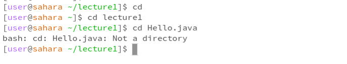
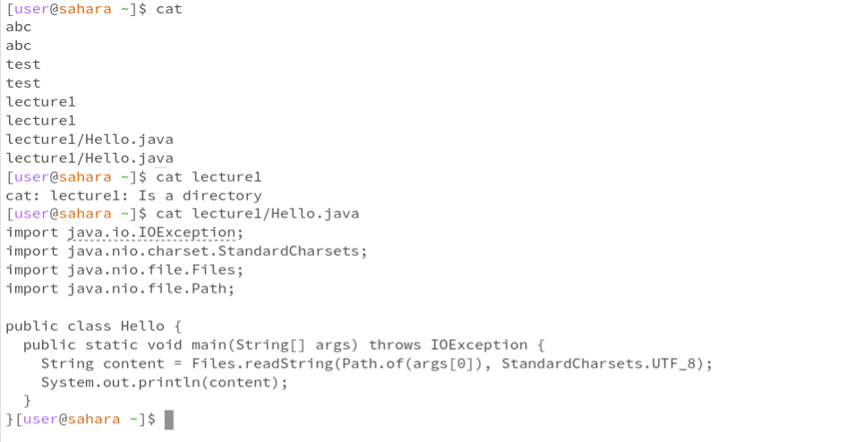

# **Lab Report 1**
## cd command examples

The command itself changes the directory when it runs:
* In the first example, the working directory is "/home/lecture1/". Command cd with no arguments changes the directory back to the home directory (/home) and returns no outputs.
* In the second example, the working directory is "/home/". Command cd with a path to a directory "cd lecture1" changes the working directory to "/home/lecture1/", which is the path in the given argument, and returns no outputs. Although lecture1 is not an absolute path, the command still works. The reason is that lecture1 is a directory within the home directory (the working directory).
* In the third example, the working directory is "/home/leture1/". Command cd with a path to a file "cd Hello.java" returns an error message saying that the given argument is not a directory. The reason is that the cd command is used for changing the working directory and it does not take a path to a file as an argument.

## ls command examples

The working directory is "/home".
Output explanation:
* Command ls with no arguments lists the folders and files that are in the working directory.
* Command ls with a path to a directory as an argument lists the folders and files in that directory.
* Command ls with a path to a file is used to confirm whether the file exists in the given location or not. The output would be the path to the file if the file exists or an error message if the file does not exist.

## cat command examples

The working directory is "/home".
Output explanation:

Share an example of using the command with no arguments.
Share an example of using the command with a path to a directory as an argument.
Share an example of using the command with a path to a file as an argument.

What the working directory was when the command was run
A sentence or two explaining why you got that output (e.g. what was in the filesystem, what it meant to have no arguments).
Indicate whether the output is an error or not, and if it’s an error, explain why it’s an error.
