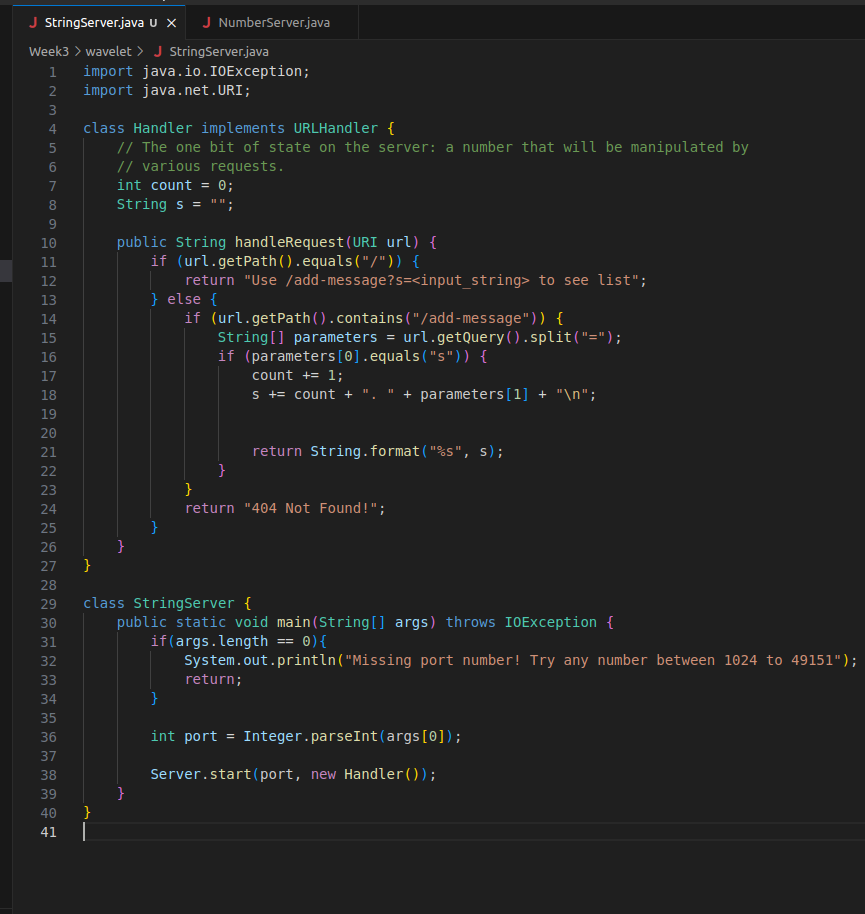
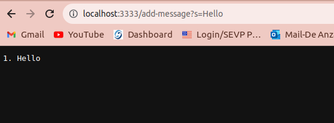
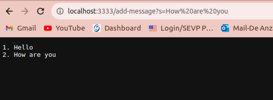
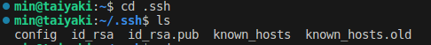
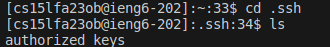
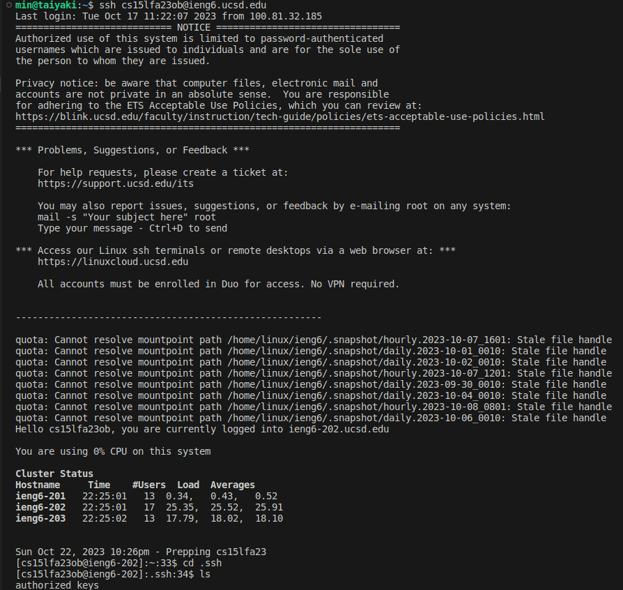

# **Lab Report 1**

**Part 1:**
*Code:*

1. The handleRequest method in class Handler is called. The relevant argument is URI url, which is dependent on your URL (the link you use to view the web page). The relevant fields of the class are variables count and s (string). The values of these fields changed from this specific request because we want to count the number of elements in our list and assign that number + the new sentence into our string. By doing that, we can keep track of sentences in old to new order and easily display the string to the website.

2. Similarly, the handleRequest method in class Handler is called. The relevant argument is URI url, which is dependent on your URL(the link you use to view the web page). The only difference here is the input sentence in our URL (“How are you” instead of one word “Hello”). The relevant fields of the class are also variables count and s (string) since the two URLs call request the same thing. The values of these fields changed from this specific request because we want to count the number of elements in our list and assign that number + the new sentence into our string. By doing that, we can keep track of sentences in old to new order and easily display the string to the website.  

**Part 2:**
- The path to the private key for your SSH key for logging into ieng6: ~/.ssh/id_rsa/

- The path to the public key for your SSH key for logging into ieng6:~/.ssh/authorized_keys/

- A terminal interaction where you log into ieng6 with your course-specific account without being asked for a password:

**Part 3:**
I have learned how to generate the ssh key and use it to log in to my remote computer without entering my password. I think this is really important, especially for people who may work with servers and other remote-controlled Linux devices in the future. 
