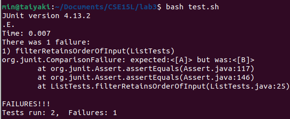

# **Lab Report 3**

**Part 1:**

1. A failure-inducing input for the buggy program, as a JUnit test and any associated code
```
    @Test
    public void filterRetainsOrderOfInput(){
        StringChecker sc = (s) -> true;
        List<String> inputList = new ArrayList<>();
        inputList.add("A");
        inputList.add("B");
        List<String> outList = ListExamples.filter(inputList, sc);
        assertEquals(2, outList.size());
        assertEquals("A", outList.get(0));
        assertEquals("B", outList.get(1));
    }
```
2. An input that doesn’t induce a failure, as a JUnit test and any associated code
```
    @Test
    public void filterDoesNotIncludeElementsWhereSCReturnsFalse(){
        StringChecker sc = (s) -> false;
        List<String> inputList = new ArrayList<>();
        inputList.add("A");
        inputList.add("B");
        List<String> outList = ListExamples.filter(inputList, sc);
        assertEquals(0, outList.size());
    }
```
3. The symptom, as the output of running the tests

    

4. The bug, as the before-and-after code change required to fix it
   Before:
```
   static List<String> filter(List<String> list, StringChecker sc) {
    List<String> result = new ArrayList<>();
    for(String s: list) {
      if(sc.checkString(s)) {
        result.add(0, s);
      }
    }
    return result;
   }
```
  After:
```
    static List<String> filter(List<String> list, StringChecker sc) {
    List<String> result = new ArrayList<>();
    for(String s: list) {
      if(sc.checkString(s)) {
        result.add(s);
      }
    }
    return result;
  }
```
Explanation: The "0" in the "add" method ```result.add(0, s)``` indicates that "s" will always be substituted to index 0 and replace the old string at index 0, instead of being appended to the end of the list. By removing "0", we now use the "add" method to append "s".

**Part 2:**
I use the "man find" command to look for the find -option that I found here.
- name option:
        ```find ./technical/biomed/ -name "rr*.txt"```
  
        ```find . -name "14*.txt"```

- path option:
        ```find . -path ./technical/biomed/1*15.txt```
  
        ```find . -path "*./*plos*.txt"```

- size option:
        ```find . -size -100M"```
  
        ```find ./technical/plos/ -size +0M -size -5M```

- type option:
        ```find . -type f```
  
        ```find . -type d```
