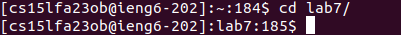
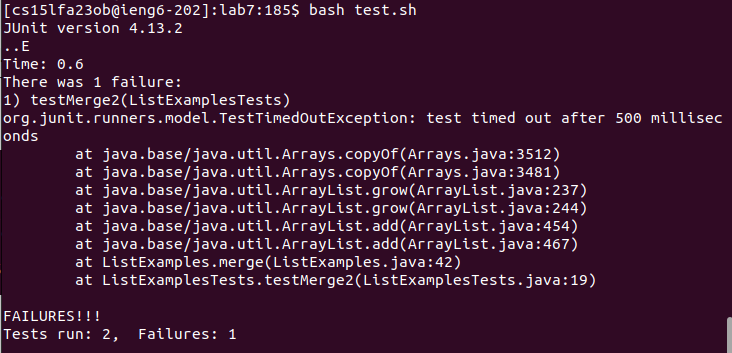

# **Lab Report 4**
**Step 4:**

  
  
  
Key pressed:
```
<Ctrl-R><s><enter>
```
The ```ssh cs15lfa23ob@ieng6.ucsd.edu``` command was in the command history, so I used ```<Ctrl-R>``` with the keyword ```<s>``` to access it. Then ```<enter>``` to run the command.

**Step 5:**

  
  
Key pressed:
```
<g><i><t></space><c><l><o><n><e></space><Ctrl-V><enter>
```
This is a new repository, so we can't use ```<up>``` or ```<Ctrl_R>``` to find the command. I copied my ssh_link for lab7 in the clipboard before starting the timer. The ```git clone``` command is used to clone the lab7 repository from my Github to the ieng6 machine. Then ```<enter>``` to run the command.

**Step 6:**

  

Key pressed:
```
<c><d></space><l><tab><enter>
```
Before running the test, we need to change the working directory to ```lab7```. The ```cd``` command is used for changing the directory. The name of the directory we want to ```cd``` in is ```lab7```, so I type ```l```. Since ```lab7``` is the only directory in the current working directory that starts with ```l```, I pressed ```<tab>``` to fill in the rest of the command. Then ```<enter>``` to run the command.

  

Key pressed:
```
<b><a><s><h></space><t><tab><enter>
```
We use the ```bash``` command to run the test script. Same with above, ```<tab>``` is used to automatically fill in the rest of the command. The test script name is ```test.sh```, so we have to specify ```<t>``` before pressing ```<tab>```. Then ```<enter>``` to run the command.
