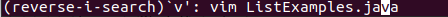
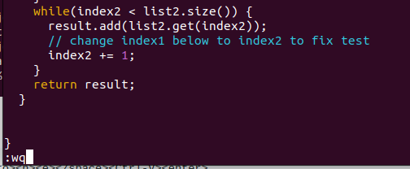
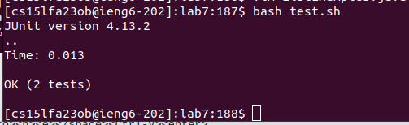
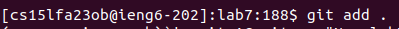
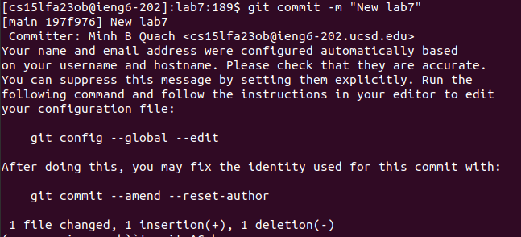
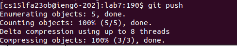

# **Lab Report 4**
**Step 4:**

  
  
  
Key pressed:
```
<Ctrl-R><s><enter>
```
The ```ssh cs15lfa23ob@ieng6.ucsd.edu``` command was in the command history, so I used ```<Ctrl-R>``` with the keyword ```<s>``` to access it. Then ```<enter>``` to run the command.

**Step 5:**

  
  
Key pressed:
```
<g><i><t></space><c><l><o><n><e></space><Ctrl-V><enter>
```
This is a new repository, so we can't use ```<up>``` or ```<Ctrl_R>``` to find the command. I copied my ssh_link for lab7 in the clipboard before starting the timer. The ```git clone``` command is used to clone the lab7 repository from my Github to the ieng6 machine. Then ```<enter>``` to run the command.

**Step 6:**

  

Key pressed:
```
<c><d></space><l><tab><enter>
```
Before running the test, we need to change the working directory to ```lab7```. The ```cd``` command is used for changing the directory. The name of the directory we want to ```cd``` in is ```lab7```, so I type ```l```. Since ```lab7``` is the only directory in the current working directory that starts with ```l```, I pressed ```<tab>``` to fill in the rest of the command. Then ```<enter>``` to run the command.

  

Key pressed:
```
<b><a><s><h></space><t><tab><enter>
```
We use the ```bash``` command to run the test script. Same with above, ```<tab>``` is used to automatically fill in the rest of the command. The test script name is ```test.sh```, so we have to specify ```<t>``` before pressing ```<tab>```. Then ```<enter>``` to run the command.

**Step 7:**

  

Key pressed:
```
<Ctrl-R><v><Ctrl-R><Ctrl-R><enter>
```
Since we have done this before, the command to edit the ListExample.java file is in my command history. I first do ```<Ctrl-R>``` to go into the search, ```<v>``` is the keyword to find the command, and then ```<Ctrl-R>``` 2 more times until I get to the right command I look for. ```<enter>``` to run the command.

  

Key pressed:
```
<Shift-G><up><up><up><up><up><up><e><r><2><:><w><q><enter>
```
I used ```<Shift-G>``` to go to the end of the file, where we need to make change. 6 ```<up>``` keypresses are to get to the line that we need to make change on. We uses ```<e>``` to get to the end of the first word, which is "index1". We want to change from "index1" to "index2", so we just need to change "1" to "2". The ```<r>``` vim command is to replace one character and back to normal mode after that. ```<2>``` is the value we want to replace "1" with. Then ```:wq``` is used to save and exit vim.

**Step 8:**

  

Key pressed:
```
<up><up><enter>
```
The ```bash test.sh``` command was 2up in the command history, so I used ```<up>``` arrow to access it. ```<enter>``` to run the command.

**Step 9:**

  

Key pressed:
```
<Ctrl_R><a><enter>
```
I use ```<Ctrl-R>``` to go into the search, ```<a>``` is the keyword to find the command ```git add .```. After seeing the expected command show up, use ```<enter>``` to run the command.

  

Key pressed:
```
<Ctrl_R><c><o><m><m><enter>
```
I use ```<Ctrl-R>``` to go into the search, ```comm``` is the keyword to find the command ```git commit -m "New lab7"``` that I have used before. After seeing the expected command show up, use ```<enter>``` to run the command. I keep adding words into the keyword untill I see the command I 'm looking for.

  

Key pressed:
```
<Ctrl_R><p><u><enter>
```
I use ```<Ctrl-R>``` to go into the search, ```pu``` is the keyword to find the command ```git push```. After seeing the expected command show up, use ```<enter>``` to run the command. 
