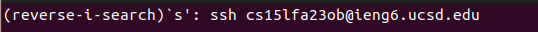
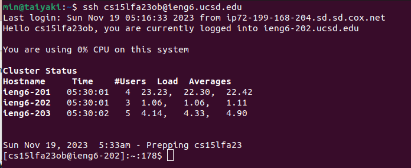
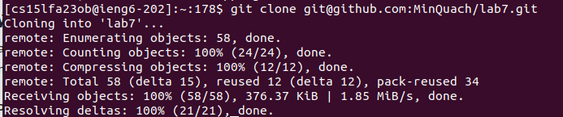

# **Lab Report 4**
**Step 4:**

  
  
  
Key pressed:
```
<Ctrl-R><s><enter>
```
The ```ssh cs15lfa23ob@ieng6.ucsd.edu``` command was in the command history, so I used ```<Ctrl-R>``` with the keyword ```<s>``` to access it. Then ```<enter>>``` to run the command.

**Step 5:**

  
  
Key pressed:
```
<g><i><t></space><c><l><o><n><e></space><Ctrl-V><enter>
```
This is a new repository, so we can't use ```<up>``` or ```<Ctrl_R>``` to find the command. I copied my ssh_link for lab7 in the clipboard before starting the timer. The ```git clone``` command is used to clone the lab7 repository to the ieng6 machine. 

**Step 6:**
