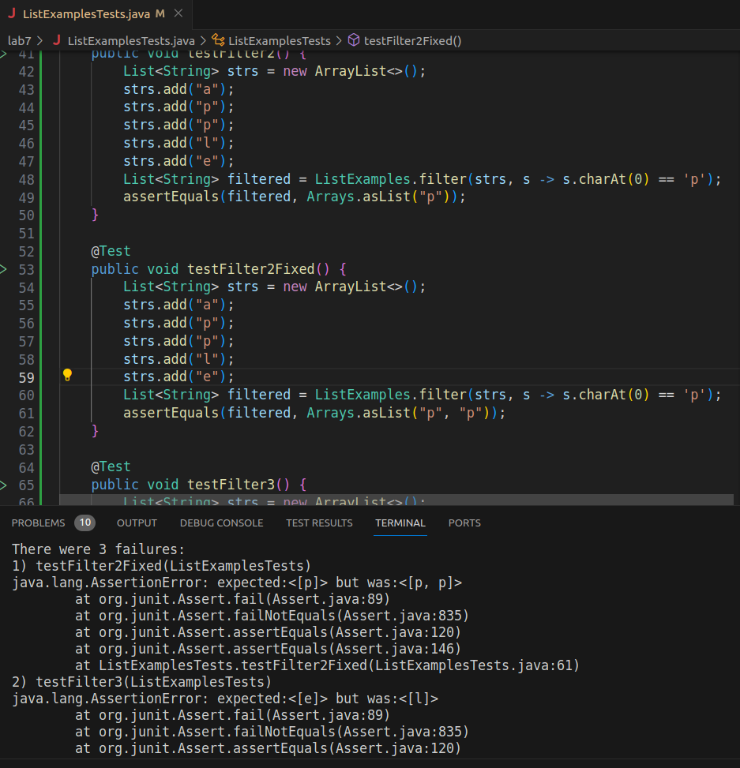

# **Lab Report 5**
**Part 1:**

***1.***

Hello TAs,

I am trying to implement the filter method from the lab. However, it seems to replace all A's with P's.


This is strange because when I try to check for P's in another test it works correctly.


I think the issue might be due to character encodings. Since it only relates to the letter 'a'. Any advice on how to resolve this would be appreciated!

Thank you,

Minh


***2.***

Hello Minh,

Have you tried with other letters other than 'a' and 'p'? Additionally, how many 'p's are you expecting in your second test?

Best,

TA

***3.***
Hello TA,

Thank you for the suggestion. Looking again I should see two P's not just one. I also tried filtering L's. This is what I got.



It turns out the error was with my filter method. I was using `remove` not `get`. Now everything works!

Thank you,

Minh

```
  static List<String> filter(List<String> list, StringChecker sc) {
    List<String> result = new ArrayList<>();
    for(int i = 1; i < list.size()-1; i ++) {
      if(sc.checkString(list.get(i))) {
        result.add(list.get(i));
      }
    }
    return result;
  }
```
***4.***

Files and directory structure:
All files should be in the same directory.
Files:
- compileAndRun.sh
- ListExamplesTests.java
- ListExamples.java

Contents of each file before fixing:

compileAndRun.sh :
```
#!/bin/bash
javac -cp .:lib/hamcrest-core-1.3.jar:lib/junit-4.13.2.jar *.java ListExamplesTests.java
java -cp .:lib/hamcrest-core-1.3.jar:lib/junit-4.13.2.jar org.junit.runner.JUnitCore ListExamplesTests
```

ListExamplesTests.java :
```
import static org.junit.Assert.*;
import org.junit.*;
import java.util.*;
import java.util.ArrayList;


public class ListExamplesTests {
	@Test(timeout = 500)
	public void testMerge1() {
    		List<String> l1 = new ArrayList<String>(Arrays.asList("x", "y"));
		List<String> l2 = new ArrayList<String>(Arrays.asList("a", "b"));
		assertArrayEquals(new String[]{ "a", "b", "x", "y"}, ListExamples.merge(l1, l2).toArray());
	}
	
	@Test(timeout = 500)
        public void testMerge2() {
		List<String> l1 = new ArrayList<String>(Arrays.asList("a", "b", "c"));
		List<String> l2 = new ArrayList<String>(Arrays.asList("c", "d", "e"));
		assertArrayEquals(new String[]{ "a", "b", "c", "c", "d", "e" }, ListExamples.merge(l1, l2).toArray());
        }

	
	@Test
	public void testFilter() {
		List<String> strs = new ArrayList<>();
		strs.add("u");
		strs.add("a");
		strs.add("p");
		strs.add("p");
		strs.add("a");
		strs.add("p");
		strs.add("e");
		strs.add("l");
		strs.add("d");
		strs.add("e");
		List<String> filtered = ListExamples.filter(strs, s -> s.charAt(0) == 'a');
		assertEquals(filtered, Arrays.asList("a", "a"));
	}

	@Test
	public void testFilter2() {
		List<String> strs = new ArrayList<>();
		strs.add("a");
		strs.add("p");
		strs.add("p");
		strs.add("l");
		strs.add("e");
		List<String> filtered = ListExamples.filter(strs, s -> s.charAt(0) == 'p');
		assertEquals(filtered, Arrays.asList("p"));
	}

	// @Test
	// public void testFilter2Fixed() {
	// 	List<String> strs = new ArrayList<>();
	// 	strs.add("a");
	// 	strs.add("p");
	// 	strs.add("p");
	// 	strs.add("l");
	// 	strs.add("e");
	// 	List<String> filtered = ListExamples.filter(strs, s -> s.charAt(0) == 'p');
	// 	assertEquals(filtered, Arrays.asList("p", "p"));
	// }

	// @Test
	// public void testFilter3() {
	// 	List<String> strs = new ArrayList<>();
	// 	strs.add("a");
	// 	strs.add("p");
	// 	strs.add("p");
	// 	strs.add("l");
	// 	strs.add("e");
	// 	List<String> filtered = ListExamples.filter(strs, s -> s.charAt(0) == 'l');
	// 	assertEquals(filtered, Arrays.asList("l"));
	// }
}
```
ListExamples.java
```
import java.util.ArrayList;
import java.util.List;

interface StringChecker { boolean checkString(String s); }

class ListExamples {

  // Returns a new list that has all the elements of the input list for which
  // the StringChecker returns true, and not the elements that return false, in
  // the same order they appeared in the input list;
  
  // Old
  static List<String> filter(List<String> list, StringChecker sc) {
    List<String> result = new ArrayList<>();
    for(int i = 1; i < list.size()-1; i ++) {
      if(sc.checkString(list.remove(i))) {
        result.add(list.remove(i));
      }
    }
    return result;
  }

  // Fixed
  // static List<String> filter(List<String> list, StringChecker sc) {
  //   List<String> result = new ArrayList<>();
  //   for(int i = 1; i < list.size()-1; i ++) {
  //     if(sc.checkString(list.get(i))) {
  //       result.add(list.get(i));
  //     }
  //   }
  //   return result;
  // }
  
  // static List<String> filter(List<String> list, StringChecker sc) {
  //   List<String> result = new ArrayList<>();
  //   for(String s: list) {
  //     if(sc.checkString(s)) {
  //       result.add(0, s);
  //     }
  //   }
  //   return result;
  // }


  // Takes two sorted list of strings (so "a" appears before "b" and so on),
  // and return a new list that has all the strings in both list in sorted order.
  static List<String> merge(List<String> list1, List<String> list2) {
    List<String> result = new ArrayList<>();
    int index1 = 0, index2 = 0;
    while(index1 < list1.size() && index2 < list2.size()) {
      if(list1.get(index1).compareTo(list2.get(index2)) < 0) {
        result.add(list1.get(index1));
        index1 += 1;
      }
      else {
        result.add(list2.get(index2));
        index2 += 1;
      }
    }
    while(index1 < list1.size()) {
      result.add(list1.get(index1));
      index1 += 1;
    }
    while(index2 < list2.size()) {
      result.add(list2.get(index2));
      // change index1 below to index2 to fix test
      index2 += 1;
    }
    return result;
  }


}
```

Command line to run: `bash compileAndRun.sh`

To fix the bug edit filter and replace the calls to `remove` with calls to `get`. In addition, add a second `"p"` into the array list in `testFilter2`. 

**Part 2: Reflection**
I learned how to grep for numbers. That is when you run the grep command, and pick out the numbers from the input string in order. This is useful in formatting output to be easier to read. For instance, when we just want to print out the number of tests failed over the total tests like the grade for the assignment.

